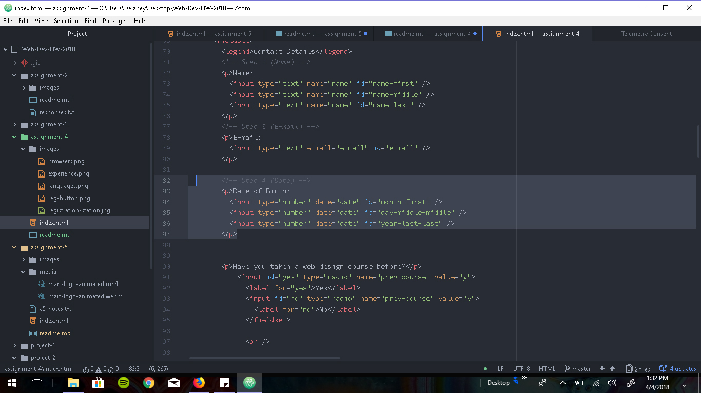

# Assignment 4

## Technical Report

### What is Alt Text and why do we use it?
Alt text is text that is included in HTML with an image to describe what the image is.  
Used for web accessibility, so that the impaired can read/hear or better understand the image.  
Is also helpful for broken image links, since it displays a white box an describes what would be there.  

#### Describe any forms you've come across while browsing the web. What purposes do they serve?
They usually serve the purpose of signing up for some website or service, these days it seems that most  
of the forms I fill out are related to the University, KBGA or the government.  
So I guess they're serving the purpose of getting me educated, paid and messed with.  
In general though, forms usually sign you up for stuff or allow websites to get information about you.  

##### Summarize your work cycle for this assignment.
I really struggled with some of the form elements and still didn't quite get one or two of them to look right  
But I finally discovered the magic of "inspecting elements" and was able to view some working webpages and some  
of my classmates work as well as the example page. I set up the head element and tried to replicate the example  
as best I could, but when I viewed the page it was missing nearly all of the sections, or the blanks/bubbles were  
missing or non-editable. So I spent a few hours going back into some examples and trying to replicate the seperate  
elements so that they worked correctly. I checked after each one and it all looked good, until I realized I had  
forgotten to add the last two images to the folder. Went back and fixed them and then lastly, had to go back and  
fix the date of birth entry that I had done incorrectly and the web languages column that I had also done incorrectly  

###### Screenshot

(incorrect birthdate entry, before fixing it)
