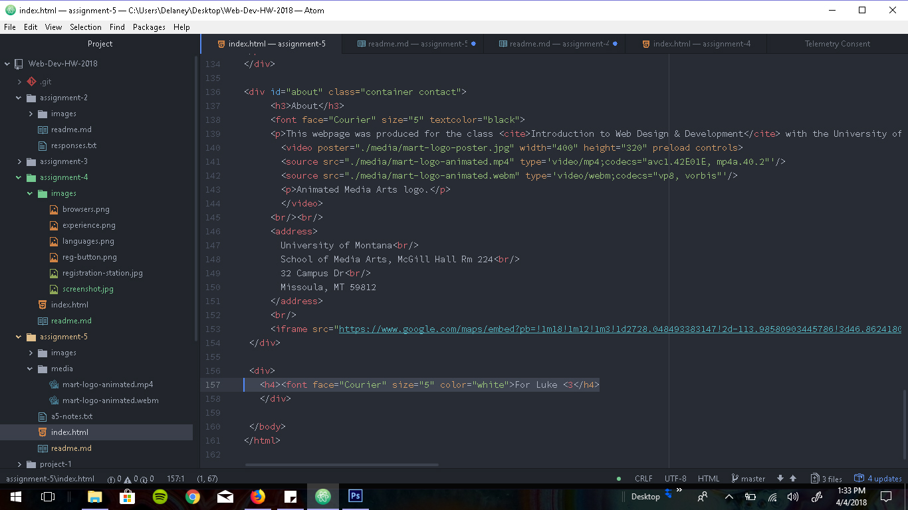

# Assignment 5

## Technical Report

###  Briefly describe the difference between divs, classes, ids, and spans.
Divs and spans are both used to group chunks of HTML, but spans are used to group 
small amounts of code inside a line, while divd are block-line and can group larger data sets. 
An ID is used to classify one element, while class is used to classify more than one.  

#### Why might I consider third-party over self-hosted media?
Self-hosted data is owned by you, so you won't get sued over it and you have creative control. 
Third-party hosted data is like videos on youtube. You don't own the data, but you don't have to worry  
about bandwith or file sizes.  

###### Summarize your work cycle.
Chose "Instant Crush" by Daft Punk. Decided to keep the design black and white and very simple. cancelled out  
border element because it just didn't look good. Found a great image of the guys that's a polaroid with a transparent  
background, so it just sits there like a polaroid. Decided to use Spotify as the media streaming agent, because  
I happen to have an account because of KBGA. Worked great, immediately. Adjusted the size. Addd a youtube video, but  
had to re-do it and add a Vevo video because they own the rights, so the youtube wouldn't show. Adjusted the size.  
messed with the fonts, ended up re-doing the head elements after the text kept getting wonkier and wonkier as I went  
Eventually went with Courier and Impact. All black. I added the UM info, but was horrified to see the text turn into  
Impact font, so I went in and changed it to a reasonably sized courier and made the blue box around it invisible  
because it looked tacky with my set-up. Lastly, I got creative and hid a little dedication easter egg on the bottom  
to my friend who loves this song. The font's white and so is the bg, so it's hidden unless hi-lighted.  

