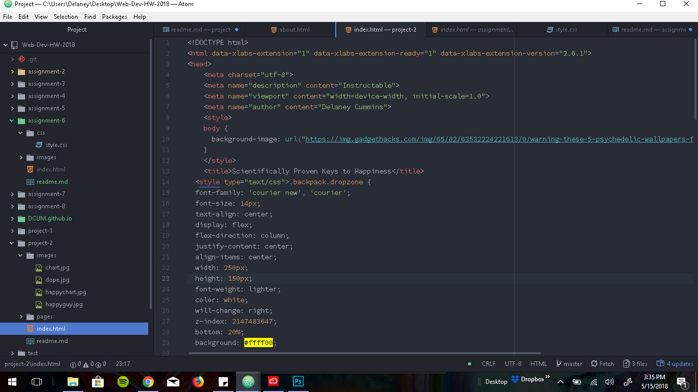

# Assignment 6

##
I chose the 80's, specifically the bitchin' lightning bolt. I'm a huge fan of the era and 80's hair metal itself,
so it was an obvious choice! I used the lightning bolt's bright yellow with a stark black, orange and white to
match the bolt and give off that obnoxious 80's color combo vibe. When creating borders, I used dashed lines
which seemed to be a commmon design for the times.

###
 The three colors that I chose, were yellow #ffff00 for the background, Orange for the text boxes and #009dff or turquoise for select font. I also used a heft amount of black and white as accent colors. Yellow, orange and that particular shade
 of teal, smack of 80's style to me. Particularly when paired with black and whit in a dramatic fashion. One of my
 friends pointed out that the web page looks like a Men at Work album.

####
My work cycle for this assignment was just to create a blank and simple webpage. I decided to just stick with text, the image, color and text boxes. After I chose my colors, I structured the text and the boxes and sort of randomly added the
lightning bolt. It came out huge and almost like a background and I loved it, so I style everything around it. It looks nice, but in hindsight, somethig didn't quite work right because it seems to almost repeat itself further down the page.

#####

