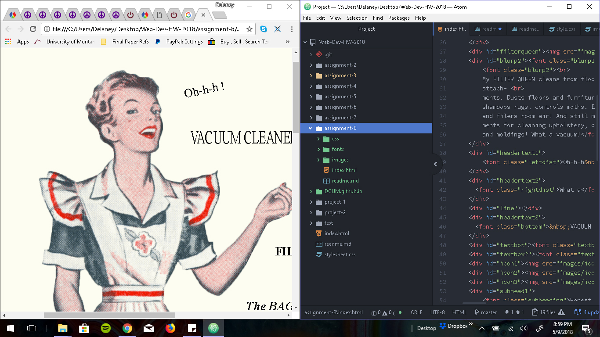

# Assignment 8-The tightest Vacuum in the world

## Technical Report

### What is the difference between padding, margin, and borders?

Padding is the space inside the border, margins are the outer space and are next to other elements and borders 
are in between the padding and the margins. So if there was an image in the element, it would be located in the padding 
with the border on the outer edges of it and the margins outside of it.

#### What was the hardest task for you to accomplish this assignment? For example, was it overlapping elements, working with muliple fonts, creating layout, or something else entriely?

Working with the images was initially the most difficult thing for me after I finally got my style sheet to work. 
We've worked with images in the past, but never overlapping them and whatnot. But once I got the formula down it just took 
some adjustments. Ultimately, the fonts are what gave me the most trouble since this is my very first time working with 
them in coding format. While everything else looked nearly just right, the fonts are still a bit off for me.

##### Summarize your work cycle for this assignment. Review this page if you need some ideas.

Downloaded the materials, set up a basic format and then struggled super hard to get the images positioned and 
sized correctly. But I believe they are for the most part, other than a little overlap and crowding. 
I struggled to get my style sheet to work, partially because I had originally named it "stylesheet" instead of "style" 
so naturally, it wasn't linking correctly. After I figured that out, I managed to give the document its proper(ish) form. 
I made a fonts.css page and tried to match the available fonts to the provided original ad. I think I did an alright job, 
but like I said, it's not perfect.

###### Embed a screenshot of your workspace at some point during your development cycle.

