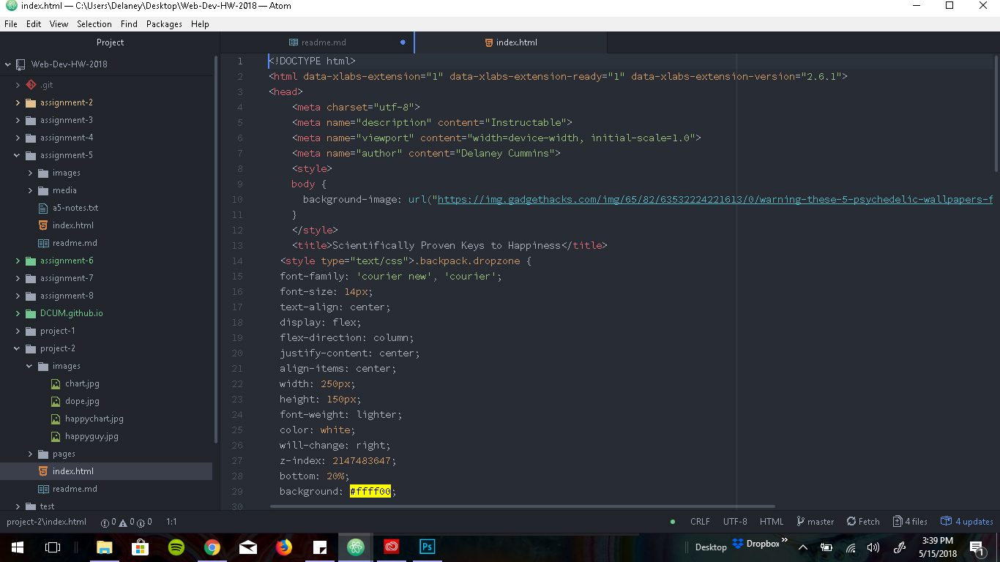

# Project 2

## HTML
This was all pretty new to me, although I knew what to expect from the class, after not passing last semester.
I had learned some basic coding in the context of modding games and editing Myspace forever ago, but only knew
simple lines, not how to set up a document or link things properly. It was interesting to learn how to create
something from the ground up. Although it was all pretty difficult for me and I spent a lot of time googling:
"how to html code this..."

###
Nervous about learning to properly link CSS documents to change the style of the HTML doc. It took me awhile to figure
out how to properly embed images and they still don't seem to work sometimes. But I'm excited to learn to do it
properly, so I can learn to make beautiful web pages that all share the same CSS style page.

####
I spent way too long trying to set up the boxes and overall form on this. I actually had it looking a lot better
and then I went too crazy right at the end adding trippy backgrounds and it just got out of control. The text ended up being
almost undreadable right before the assignment was due and I couldn't figure out how to undo my code to make it return
to a more desireable format.

#####

